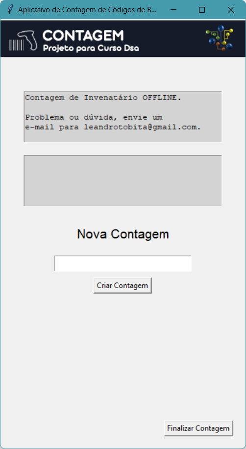
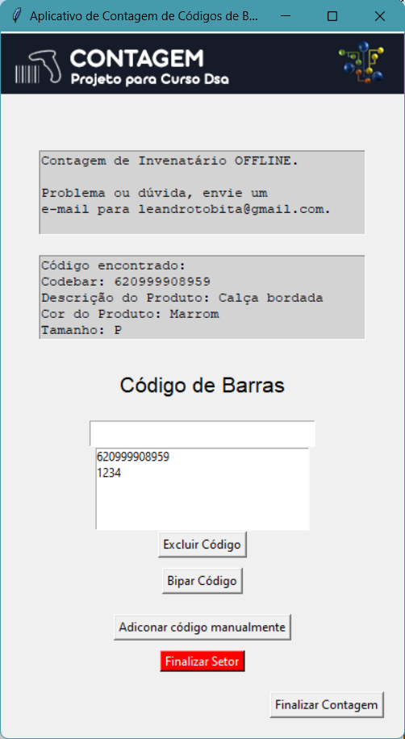
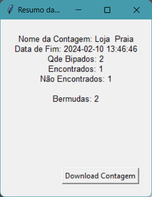

# AppContagem

## Estudo de Caso: Desenvolvimento do Aplicativo de Contagem de Códigos de Barras - AppContagem

### Contexto:

Ao enfrentar desafios na contagem manual de itens nas lojas do grupo, reconhecemos a necessidade de uma solução mais eficiente e precisa. O desenvolvimento do AppContagem surgiu como resposta a essa demanda, visando simplificar o processo de contagem por meio de códigos de barras, oferecendo uma interface intuitiva e funcionalidades abrangentes.

### Processo de Pensamento:

* Identificação da Necessidade: Inicialmente, analisamos os problemas enfrentados nas operações de contagem manual e reconhecemos a oportunidade de automatizar e simplificar esse processo por meio da tecnologia de códigos de barras.

* Análise de Requisitos: Definimos os requisitos essenciais do aplicativo, incluindo a capacidade de criar e gerenciar contagens, adicionar setores, bipar códigos de barras, visualizar resumos e exportar dados.

* Seleção de Tecnologias: Optamos por utilizar Python para a lógica do aplicativo devido à sua versatilidade e eficiência, e Tkinter para a criação da interface do usuário. O SQLite3 foi escolhido como banco de dados embutido para armazenar os dados das contagens e códigos de barras de forma local.
Desafios Enfrentados:

* Integração de Funcionalidades Complexas: Um dos principais desafios foi integrar funcionalidades complexas, como a gestão de setores e a finalização de contagens, de forma intuitiva e eficiente na interface do usuário.
Gerenciamento de Dados: Garantir a integridade e eficiência no armazenamento e manipulação dos dados das contagens e códigos de barras representou um desafio, especialmente considerando a natureza dinâmica das operações de contagem.
Superando os Desafios:

* Design Iterativo: Adotamos uma abordagem iterativa no desenvolvimento do aplicativo, realizando testes frequentes com usuários reais para obter feedback e aprimorar continuamente a usabilidade e funcionalidades.

* Otimização de Desempenho: Implementamos estratégias de otimização de desempenho para garantir uma experiência fluida e responsiva, especialmente durante a manipulação de grandes conjuntos de dados.

### Resultados:

O AppContagem oferece uma solução eficaz e eficiente para a contagem de itens por meio de códigos de barras. Simplificou significativamente o processo de contagem, reduzindo erros e aumentando a produtividade das equipes de inventário. Além disso, proporcionou uma melhor organização e análise dos dados de estoque, contribuindo para uma gestão mais eficaz e informada do inventário.

## Tecnologias Usadas

- **Python**: Linguagem de programação utilizada para desenvolver a lógica do aplicativo.
- **Tkinter**: Biblioteca gráfica utilizada para criar a interface do usuário.
- **SQLite3**: Banco de dados embutido utilizado para armazenar os dados das contagens e códigos de barras.

## Funcionalidades

- Criar uma nova contagem.
- Adicionar e gerenciar setores dentro de uma contagem.
- Bipar códigos de barras e registrar se foram encontrados ou não em um setor.
- Excluir códigos de barras.
- Finalizar um setor ou uma contagem.
- Visualizar um resumo da contagem com estatísticas.
- Você pode sempre guardar o inventario.db ou apagá-lo. Toda vez que o sistema iniciar, caso não existe o arquivo inventario.db, o sistema criará um novo.

## Configuração e Execução

### Pré-requisitos

- Python instalado na máquina.

### Instalação e Execução

1. Clone o repositório do GitHub para sua máquina local:

git clone https://github.com/leandrotobita/appcontagem.git

2. Navegue até o diretório do projeto:

cd appcontagem

3. Execute CriarCodigoBarrasDB.py para criar o codigobarras.db (dados dos produtos)

phyton CriarCodigoBarrasDB.py

3. Execute o aplicativo Python:

python AppContagem.py

Isso iniciará o aplicativo de contagem de códigos de barras.

### Telas

 

 

 

